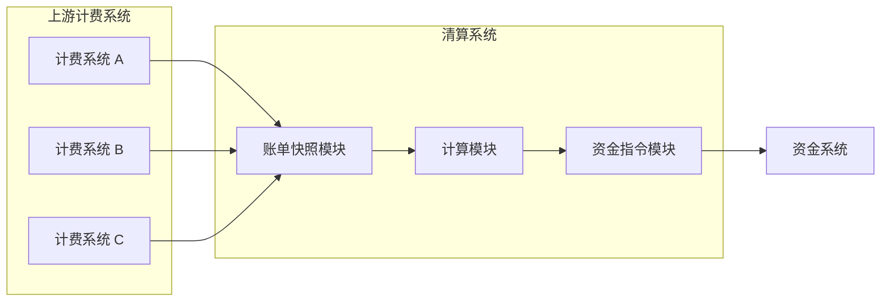

# merchant-feecal-mvp

这是一个清算相关的验证型项目，不是生产系统。  
目的很简单：**系统现有的问题能不能被模型解决，以及模型将来会不会把系统带沟里去。**

---

## 这个项目想验证什么

在当前的清算系统里，常见的问题有：

- 上游账单字段杂、口径不一，清算逻辑被迫到处打补丁；
- 分账规则经常变，最后全写进费用项里，改一次牵一大片；
- 完全自动化之后，这个模型是否还能兜住随之出现的新问题。

**模型本身能不能把这些问题兜住。**

---

## （一）对现有问题，模型能不能顶得住

主要看三件事：

- **账单防腐层**  
  上游数据再脏，这一层能不能兜住，不把清算内核拖下水；

- **指令作为扩展点**  
  分账规则再怎么变，能不能只加指令，不去动费用项和核心流程；

- **状态驱动执行**  
  能不能不再靠流程硬推，避免调度空跑、任务白跑一圈。

这些如果顶不住，后面谈自动化、谈规模都没意义。

---


## （二）整体架构
清算系统包含中间三块：账单快照、计算、资金指令。

（该图仅用于说明核心结构关系，省略实现与部署细节。）



---

## （三）跑大、跑久、没人盯着之后，会不会出新问题

这个项目不会现在就解决这些问题，但至少要想清楚**会不会在这里翻车**：

- 自动化之后，数据量和规则数量都上来，这套模型还能不能撑住，
  会不会最后退化成一堆顺序流程，只是换了个名字；

- 真正无人值守之后，系统在异常情况下会不会“自己把事情做错”，
  比如状态被错误推进、问题被悄悄吞掉，反而把影响越放越大。

如果模型天生就会往这两个方向滑，那现在就要及时调整。

---

## （四）目录说明
```
merchant-feecal-mvp/
├─ src/main/java/com/merchant/feecal
│  ├─ adapter/                  # 上游计费系统适配
│  ├─ controller/               # 清算入口与指令接口
│  ├─ domain/                   # 领域模型与装配
│  ├─ dto/                      # 请求/响应 DTO
│  ├─ facade/                   # 对外聚合入口
│  ├─ repo/                     # jOOQ 数据访问
│  ├─ service/
│  │  ├─ billing/               # 账单聚合/快照
│  │  ├─ core/                  # 清算核心编排
│  │  ├─ fund/                  # 资金指令生成/执行
│  │  └─ summary/               # 清算汇总场景
│  └─ termdef/                  # 费用项/规则定义
├─ src/main/resources/wiki       # 设计文档与思考记录
├─ database                      # Flyway 迁移脚本
├─ scripts                       # 本地调用脚本（TS）
└─ README.md
```

## 备注
仓库忽略了本地敏感配置（如 `application.yml`、`gradle.properties`），请自行补齐。
