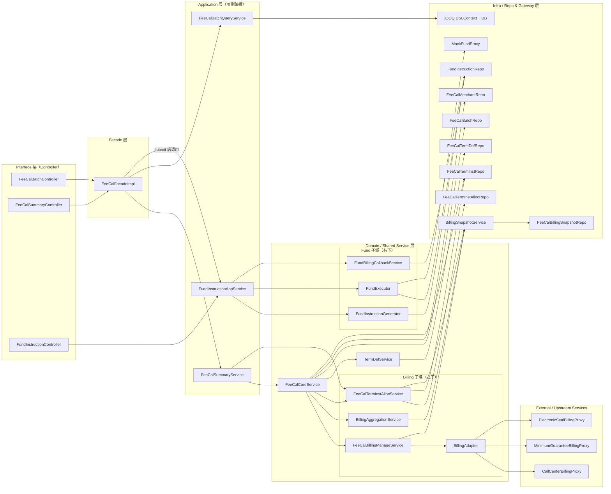

# FeeCal MVP Service 调用关系图

## 1. 分层原则
- **Interface 层**：只承载 HTTP 协议与参数校验，统一返回 `ResponseResult`/`PageResult`；
- **Facade 层**：聚合 FeeCal 核心与批次列表入口，避免前端直接触碰多个服务；
- **Application 层**：面向用例编排（Summary、Fund、Batch Query），不处理细节；
- **Domain / Shared Service 层**：沉淀可复用的领域能力（Core、BillingManage、Alloc、Fund* 等）；
- **Infra / Gateway 层**：纯粹的数据访问、网关代理、上游/下游交互，保持无业务态；
- 通过分层保证“可替换/可扩展/可并行演进”，例如后续接入真实资金网关时，只需替换 `FundGateway`。

## 2. FeeCal 模块完整调用关系（按层分组）

### 解读要点
- **接口 → Facade → Application**：批次列表与清算主流程共享 Facade，资金指令走独立 AppService 以便复用；
- **Core → BillingManage → BillingAdapter/Proxy**：拉账、聚合、账单级分配统一由 Core 驱动，确保 Batch 状态只在 Core 维护；
- **Alloc Flow**：`start/refresh` 自动调用 `FeeCalTermInstAllocService`，页面交互也通过 SummaryService 落账单分配，保持 term 内聚；
- **Fund Flow**：`FundInstructionAppService` 同时支持自动生成（Summary submit 触发）与手工生成/执行/回调，`FundExecutor` 独立封装网关调用；
- **Infra 解耦**：所有 Repository / Proxy / Gateway 为无状态 Bean，可在 Phase3.2 直接替换实现或切换真实依赖。
