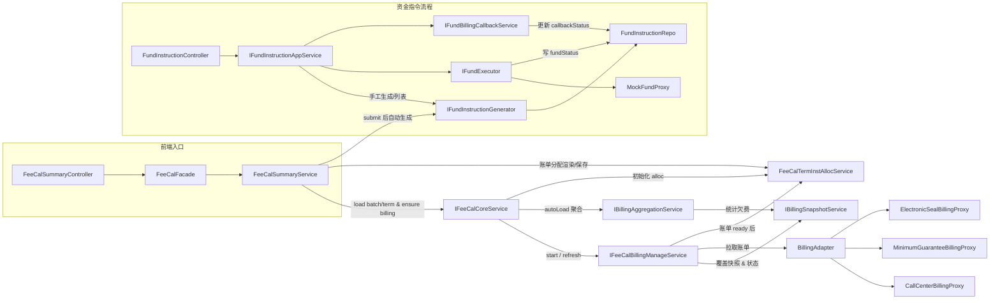

# 清算系统 Phase3-1.3.1：资金指令模块技术设计（MVP）

- **版本**：v1.0
- **状态**：可直接指导前后端实现

---

## 0. 文档目的

在不改变 Phase1（清算核心）与 Phase2（BillingAdapter）的前提下，引入 **资金指令（FundInstruction）** 模块，实现：

- 基于 Batch + TermInst 自动生成资金指令；
- 支持财务手工执行、重试；
- 支持批次维度的资金指令展示；
- 支持“资金执行状态 + 回写计费状态”两条正交状态线；
- 当前阶段仅支持 **保证金账户** 的扣款/退款。

本设计为 Phase3 的 1.3.1（MVP）阶段，只覆盖最小可行闭环。

---

## 1. 背景与总览

### 1.1 Phase1 / Phase2 现状
- `TermInst` = 清算本体聚合根  
- `BillingView` = 上游账单快照，不参与清算规则  
- `billingDataStatus` = 账单准备状态机  
- `Batch.status` = 清算主状态（算账）  
- 清算截止于 `SubmitSummary`，但没有“资金执行”能力。

### 1.2 Phase3-1.3.1 的目标
- 新增资金指令表 `fee_cal_fund_instruction`；
- 提供自动生成资金指令能力；
- 支持财务执行/重试指令；
- 支持资金执行状态与回写计费状态双状态线；
- 不对接真实计费回写，仅预留 `callbackStatus`。

---

## 2. 范围（Scope）

### 2.1 本阶段包含内容

- 仅支持 **保证金账户（DEPOSIT）** 的扣款/退款：
  - TermInst 抵扣金额 → 保证金扣款；
  - Batch.depositRemain → 整体保证金退款。
- 指令暂按 1:1 建模（整体退款除外），待多账户/拆单场景出现时再引入关系表。
- 能力列表：
  1. 指令生成（扣款指令 + 退款指令）；
  2. 指令展示（按 batchNo）；
  3. 单条执行、单条重试；
  4. `fundStatus`（资金执行状态）；
  5. `callbackStatus`（回写计费状态）。

### 2.2 本阶段不包含内容（1.3.2 补齐）

- 指令与 TermInst / Billing 的多对多关系；
- 非保证金账户；
- 自动回写计费；
- 资金状态轮询（当前默认同步）；
- 真实资金系统 API；
- 批量执行 / 批量审核 / 审批流 / 风控策略；
- 指令拆分与合并。

---

## 3. 领域核心概念

### 3.1 参与方
- 一号位（平台阵营）：平台、品牌主、区代主；
- 二号位（商户阵营）：加盟商、门店等；
- 资金动作从“一号位视角”描述：收、扣、退。

### 3.2 金额
- `shouldAmount`：应执行金额（来自 TermInst / depositRemain）；
- `actualAmount`：资金系统返回结果（支持多次付款，但 MVP 简化为一次）。

### 3.3 状态（两条正交状态线）
- `fundStatus`（资金执行状态）
  - `PENDING`
  - `EXECUTING`
  - `SUCCESS`
  - `FAIL`
- `callbackStatus`（回写计费状态）
  - `NOT_STARTED`
  - `DOING`
  - `SUCCESS`
  - `FAIL`

### 3.4 附件
- 资金流水、审批材料等，通过 `attachmentIds`（字符串或数组）挂接。

---

## 4. 表结构设计

### 4.1 主表 `fee_cal_fund_instruction`

```sql
CREATE TABLE `fee_cal_fund_instruction` (
  `id` BIGINT PRIMARY KEY AUTO_INCREMENT COMMENT '指令主键ID',

  `batch_no` VARCHAR(64) NOT NULL COMMENT '清算批次编号',
  `term_inst_id` BIGINT DEFAULT NULL COMMENT '来源费用项ID；整体保证金退款可为空',

  `settle_subject_type` VARCHAR(32) NOT NULL COMMENT '清算主体类型：MERCHANT/STORE/AGENT',
  `settle_subject_no` VARCHAR(64) NOT NULL COMMENT '清算主体编码',

  `payer_type` VARCHAR(32) NOT NULL COMMENT '付款方类型：MERCHANT/PLATFORM/AGENT',
  `payer_no`   VARCHAR(64) NOT NULL COMMENT '付款方编码',
  `payee_type` VARCHAR(32) NOT NULL COMMENT '收款方类型：MERCHANT/PLATFORM/AGENT',
  `payee_no`   VARCHAR(64) NOT NULL COMMENT '收款方编码',

  `fund_direction` VARCHAR(16) NOT NULL COMMENT 'DEBIT(扣款)/CREDIT(退款)/COLLECT(收款)',
  `fund_biz_type`  VARCHAR(32) NOT NULL COMMENT 'DEPOSIT_DEDUCT/DEPOSIT_REFUND',

  `account_type` VARCHAR(16) NOT NULL DEFAULT 'DEPOSIT' COMMENT '账户类型：当前只支持DEPOSIT',

  `should_amount` DECIMAL(18,2) NOT NULL COMMENT '应执行金额',
  `actual_amount` DECIMAL(18,2) DEFAULT NULL COMMENT '实际执行金额',

  `fund_status`     VARCHAR(16) NOT NULL COMMENT 'PENDING/EXECUTING/SUCCESS/FAIL',
  `callback_status` VARCHAR(16) NOT NULL COMMENT 'NOT_STARTED/DOING/SUCCESS/FAIL',

  `fund_order_id`   VARCHAR(64) DEFAULT NULL COMMENT '资金系统单号',
  `fund_channel`    VARCHAR(32) DEFAULT NULL COMMENT '资金渠道',
  `fund_order_info` JSON        DEFAULT NULL COMMENT '资金单详情JSON',

  `attachment_ids` VARCHAR(512) DEFAULT NULL COMMENT '附件ID列表',

  `created_at` DATETIME NOT NULL DEFAULT CURRENT_TIMESTAMP,
  `updated_at` DATETIME NOT NULL DEFAULT CURRENT_TIMESTAMP ON UPDATE CURRENT_TIMESTAMP,

  KEY `idx_batch_no` (`batch_no`),
  KEY `idx_term_inst` (`term_inst_id`),
  KEY `idx_fund_status` (`fund_status`),
  UNIQUE KEY `uk_batch_term_biz` (`batch_no`, `term_inst_id`, `fund_biz_type`)
) ENGINE=InnoDB DEFAULT CHARSET=utf8mb4 COMMENT='资金指令表';
```

### 4.2 费用项账单分配表 `fee_cal_term_inst_alloc`

```sql
CREATE TABLE `fee_cal_term_inst_alloc` (
  `id` BIGINT PRIMARY KEY AUTO_INCREMENT COMMENT '主键ID',
  `batch_no` VARCHAR(64) NOT NULL COMMENT '清算批次号',
  `term_inst_id` BIGINT NOT NULL COMMENT '费用项实例ID',
  `term_code` VARCHAR(64) NOT NULL COMMENT '费用项 code',
  `billing_snapshot_id` BIGINT NOT NULL COMMENT '关联账单快照ID',
  `billing_key` VARCHAR(128) NOT NULL COMMENT '账单标识',
  `billing_desc` VARCHAR(256) DEFAULT NULL COMMENT '账单描述',
  `unpaid_amount` DECIMAL(18,2) NOT NULL COMMENT '账单未付金额',
  `alloc_flag` TINYINT NOT NULL DEFAULT 0 COMMENT '是否抵扣',
  `alloc_amount` DECIMAL(18,2) NOT NULL DEFAULT 0 COMMENT '抵扣金额',
  `created_at` DATETIME NOT NULL DEFAULT CURRENT_TIMESTAMP,
  `updated_at` DATETIME NOT NULL DEFAULT CURRENT_TIMESTAMP ON UPDATE CURRENT_TIMESTAMP,
  UNIQUE KEY `uk_term_snapshot` (`term_inst_id`, `billing_snapshot_id`),
  KEY `idx_batch_term` (`batch_no`, `term_code`)
) ENGINE=InnoDB DEFAULT CHARSET=utf8mb4 COMMENT='费用项账单级分配';
```

> 另外在 `fee_cal_term_def` 中增加字段 `bill_alloc_enabled` 以支持后续配置化（当前仍由代码侧白名单驱动）。

## 5. 用例设计（Application Use Cases）

### 5.1 `GenerateFundInstructionsForBatch(batchNo)`
- **触发**：`SubmitSummary` 成功后或运维手工触发。
- **逻辑**：
 1. 遍历批次所有 TermInst；
 2. 对有 `deductAmount > 0` 的费用项生成“保证金抵扣”指令；
 3. 若 `depositRemain > 0`，生成一条“保证金退款”指令（`term_inst_id = null`）；
 4. 幂等保证：`(batchNo, termInstId, fundBizType)` 唯一。
 5. `FeeCalSummaryService.submit` 成功后后台自动触发一次，页面也可手动补触发。

### 5.2 `ListFundInstructions(batchNo)`
- 批次维度查询接口，返回：
  - `id`, `termInstId`；
  - `payer/payee` 信息；
  - `fundDirection`, `fundBizType`；
  - `shouldAmount / actualAmount`；
  - `fundStatus / callbackStatus`；
  - 创建时间、备注。

### 5.3 `ExecuteFundInstruction(instructionId, operator)`
- 仅支持手工执行；
- 校验：`fundStatus ∈ {PENDING, FAIL}`；
- 组装资金请求（MVP 可 Mock），更新状态/流水信息；
- 本阶段同步返回 `SUCCESS`，异步轮询放到 1.3.2；
- **当前版本无需额外日志**，若后续开启清算审计，再补专用日志表。

### 5.4 `RetryExecuteFundInstruction(instructionId, operator)`
- 同执行流程，只允许 `fundStatus=FAIL`。

### 5.5 `CallbackBillingForFund(instructionId)`
- 预留计费回写接口；
- 校验 `fundStatus=SUCCESS`，直接置 `callbackStatus=SUCCESS`（伪实现）。

### 5.6 `ManageTermBillAllocations(termCode)`
- **触发**：清算页面打开（读取）、保存/提交（写入）；
- **逻辑**：
  1. `summary/start` 完成后，后台根据账单快照在 `fee_cal_term_inst_alloc` 初始化默认分配（所有账单 `alloc_flag=0`，`alloc_amount=0`）；
  2. 页面渲染时，如果 `termCard.supportBillAlloc=true`，返回 `billItems[]`（包含账单标识、未付金额、当前抵扣状态）；
  3. 用户在页面逐条勾选并填写抵扣金额，前端将 `billItems` 回传给 `calculate/saveDraft/submit`；
  4. 保存/提交时，后端校验「单条金额 ≤ 未付金额」「账单抵扣合计 = term 抵扣金额」，然后落库到 `fee_cal_term_inst_alloc`。

---

## 6. 领域服务设计

### 6.1 FundInstructionGenerator
- `FeeCalFundInstructionEntity buildDeductInstruction(BatchContext ctx, TermInst termInst)`
- `FeeCalFundInstructionEntity buildRefundInstruction(BatchContext ctx, BigDecimal depositRemain)`

### 6.2 FundInstructionAppService
- `generateForBatch(batchNo)`：封装生成能力（Submit 成功后自动调用，页面也可手工触发）；
- `listByBatch(batchNo)`：聚合展示；
- `execute/retry/callback`：编排 `FundExecutor`、`FundBillingCallbackService`，并处理附件/操作者信息。

### 6.3 FundExecutor + FundGateway
- `FundExecutor` 管理指令状态流转（PENDING → EXECUTING → SUCCESS/FAIL），并回写 `actualAmount/fundOrderId/fund_order_info`；
- `FundGateway` 当前由 `MockFundProxy` 承载（逻辑 Mock），后续可平滑替换为真实资金系统。

### 6.4 FundBillingCallbackService
- 校验 `fundStatus=SUCCESS`，再把 `callbackStatus` 切到 `SUCCESS`；
- 回调触发点只允许一次（若存在幂等需求，可在 1.3.2 补充 token）。

> Controller 只与 `FundInstructionAppService` 交互，由 AppService 统一 orchestrate generator / executor / callback，避免交互层直接串联多个领域服务。

### 6.5 服务调用关系（MVP）

- `FeeCalSummaryController → FeeCalFacade → FeeCalSummaryService`：页面接口统一编排；
- `FeeCalCoreService` 在 `start/refresh` 中串起 `IFeeCalBillingManageService`、`IBillingAggregationService` 与 `FeeCalTermInstAllocService`；
- `FeeCalSummaryService` 负责账单分配渲染/保存，并在 `submit` 后触发 `IFundInstructionGenerator`；
- `FundInstructionController` 侧由 `IFundInstructionAppService` 串联 `IFundInstructionGenerator`、`IFundExecutor`、`FundGateway(MockFundProxy)` 和 `IFundBillingCallbackService`；
- `BillingAdapter` 面向多个上游 Proxy（电子签章、保底、400 呼叫），`IBillingSnapshotService` 承载账单落库与聚合。



### 6.6 FeeCalTermInstAllocService
- `rebuildAllocations(batchNo)`：在 `summary/start`、`refreshBillingData` 成功后，根据账单快照重建 `fee_cal_term_inst_alloc`；
- `loadBillItems(termInstIds)`：按 termInstId 返回账单列表（供页面渲染）；
- `applyAllocations(termInst, billItems, termDeduct)`：保存/提交时校验并落账单抵扣，保证账单合计与 term 抵扣一致。

---

## 7. API 草案

| 方法 | URI | 说明 |
|------|-----|------|
| GET  | `/web/feeCal/batch/list`              | 查询清算批次列表（PageResult 返回批次卡片，支持主体/状态筛选） |
| POST | `/web/feeCal/fund/batch/{batchNo}/generate` | 生成资金指令（幂等，可手工触发） |
| GET  | `/web/feeCal/fund/batch/{batchNo}/list`     | 查询资金指令列表 |
| POST | `/web/feeCal/fund/{id}/execute`             | 执行单条指令（PENDING） |
| POST | `/web/feeCal/fund/{id}/retry`               | 重试执行（FAIL） |
| POST | `/web/feeCal/fund/{id}/callback`            | 回写计费状态（SUCCESS→SUCCESS） |

---

## 8. 前端页面（财务视角）

### 8.1 清算列表页（入口）
- 新增清算批次列表页（支持主体、批次状态筛选），供财务/运营快速定位批次；
- 列表项需展示基础批次信息及资金指令聚合状态（可后续补充），点击后跳转至清算详情页；
- 这是进入“资金指令”标签的统一入口，保证历史批次也能被检索与操作。

### 8.2 清算详情页新增“资金指令”标签
- 展示：资金动作（扣款/退款）、收付双方、应执行金额、`fundStatus`、`callbackStatus`；
- 操作按钮：执行 / 重试；
- 与列表页联动，支持刷新指令列表与查看历史操作记录。

---

## 9. 扩展点（1.3.2 预留）

1. 指令 detail 粒度拓展：支持多账户/拆单/合单等更复杂映射；
2. 支持非保证金账户（多账户体系）；
3. 资金系统异步轮询；
4. 计费系统实收回写 + 幂等；
5. 批量执行、审批流；
6. 指令拆分与合并。

---

## 10. 目录结构建议（后端）

```
/batch
  FeeCalBatchController.java
  /service
    IFeeCalBatchQueryService.java
    FeeCalBatchQueryServiceImpl.java
/fund
  /controller
    FundInstructionController.java
  /service
    IFundInstructionAppService.java
    FundInstructionAppServiceImpl.java
    IFundInstructionGenerator.java
    FundInstructionGeneratorImpl.java
    IFundExecutor.java
    FundExecutorImpl.java
    IFundBillingCallbackService.java
    FundBillingCallbackServiceImpl.java
  /domain
    /model
      FeeCalFundInstructionEntity (jOOQ POJO)
    /service
      (同上，接口 + Impl)
    /repository
      FundInstructionRepo.java
    /gateway
      FundGateway.java
      MockFundProxy.java
```

---

## 11. 设计总结

Phase3-1.3.1 的目标是把“清算结果 → 资金执行”切成一个干净、可扩展的子域：

- `TermInst` 仍然是清算本体；
- `FundInstruction` 负责“动钱”；
- 资金状态 & 回写状态独立，callback 只允许在资金成功后触发一次；
- 当前按 1:1 设计，待需要时再引入 detail 关系表；
- 代码量预估 3～5 天即可完成后端全部实现。
