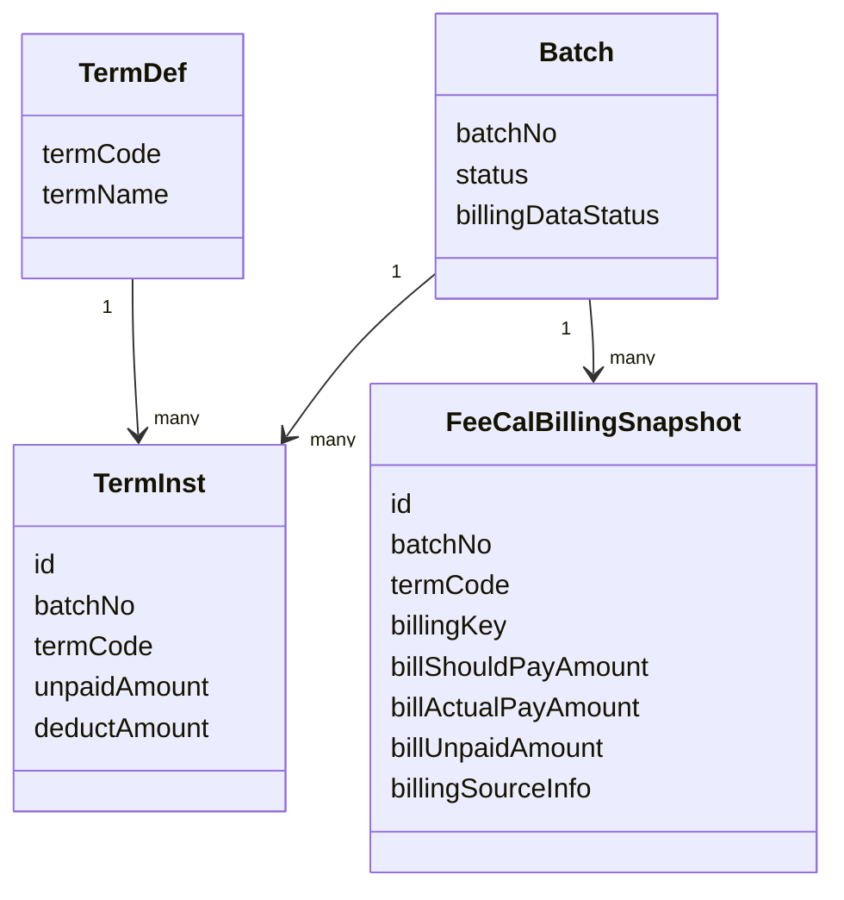
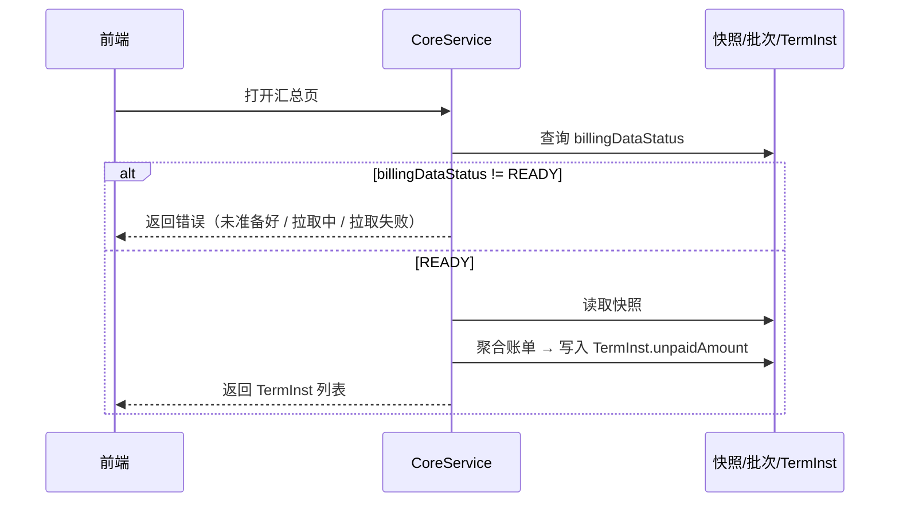
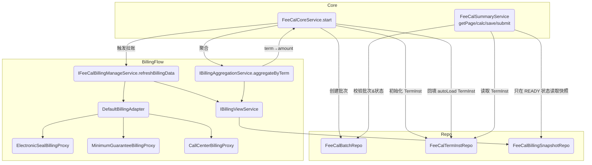

# 清算系统 Phase2：BillingAdapter 自动计费接入设计文档（MVP 第二步）

版本：v1
日期：2025-11-25

---

## 0. 文档目的

本设计文档用于说明清算系统 **Phase2（MVP 第二步）——自动计费接入（BillingAdapter）** 的设计方案，指导代码实现。

本阶段目标是在 **不修改 Phase1 清算核心抽象（Batch / TermInst / TermDef）** 的前提下，引入上游计费账单能力，实现：

- 统一的“清算账单快照”（FeeCalBillingSnapshot）；
- 基于批次的账单快照机制；
- 自动聚合欠费金额并填充 TermInst 默认值；
- 由批次状态机控制的“拉账 / 重拉”流程。

---

## 1. Phase1 回顾（汇总 MVP）

### 1.1 已有核心设计

- **清算本体抽象为 TermInst（费用项实例）**
    - TermInst 是清算领域的聚合根；
    - 清算金额、草稿、汇总、提交均围绕 TermInst 展开。

- **汇总阶段是唯一产出点**
    - 所有应退、应扣、欠费、余额等最终结果在汇总阶段一次性产出；
    - 流程节点不再承载最终金额。

- **金额全部为手工输入**
    - TermInst.unpaidAmount 等金额由前端人工录入；
    - 未接上游计费系统。

- **核心表结构稳定**
    - `fee_cal_batch`：清算批次；
    - `fee_cal_term_inst`：费用项实例；
    - `fee_cal_term_def`：费用项定义。

### 1.2 问题与痛点

- 欠费金额无来源依据，无法审计、无法追溯；
- 上游计费系统多套，字段和结构异构；
- 清算操作高度依赖人工抄写上游金额，效率低且易错。

---

## 2. Phase2 设计目标与边界

### 2.1 设计目标

1. **保持清算领域模型不变**
    - 不在 TermInst 中增加任何上游账单字段；
    - 清算域不直接感知计费系统细节。

2. **引入清算自有账单快照 FeeCalBillingSnapshot**
    - 统一表示来自不同计费系统的欠费账单；
    - 作为清算系统内的“账单标准结构”。

3. **实现 BillingAdapter 适配层**
    - 屏蔽上游异构数据源；
    - 承担“拉账 + 转换 + 生成快照”的职责。

4. **账单快照化（可重放）**
    - 账单数据落库为快照，包含原始 JSON；
    - 支持审计、问题排查、必要场景下的重拉。

5. **自动填充 TermInst 未付金额**
    - 基于账单视图聚合出欠费金额；
    - 作为 TermInst.unpaidAmount 的默认值（可被人工覆盖）。

6. **建立批次级账单状态机**
    - 将“拉账 / 重拉 / 拉账失败”纳入批次生命周期管理。

### 2.2 本阶段不做的内容（明确边界）

- 不接入资金系统，不发起实际扣款 / 退款；
- 不实现账单冻结 / 解冻 / 写实收，仅为后续预留空间；
- 不新增 Prepare 盘点节点，仍以汇总为唯一产出点。

---

## 3. DDD 领域建模

### 3.1 核心领域对象及职责

| 对象 | 类型 | 职责 |
|------|------|------|
| Batch | 实体 | 表示一次清算批次，持有整体状态及账单状态 |
| TermInst | 聚合根 | 表示某批次下某费用项的清算结果（unpaid / 应退 / 抵扣等） |
| TermDef | 定义 | 费用项配置，决定 TermInst 初始化集合及规则 |
| FeeCalBillingSnapshot | 值对象 | 上游账单在清算世界的统一快照视图 |
| BillingAdapter | 领域服务（外部适配） | 拉取上游账单，转换并生成 FeeCalBillingSnapshot 快照 |
| BillingAggregationService | 领域服务（内部） | 从账单视图聚合欠费，填充 TermInst 默认值 |

### 3.2 领域关系示意



### 3.3 整体清算流程总览（Phase1 + Phase2 + 预留 Phase3）

从一次清算批次的生命周期视角，整体流程可以抽象为以下 6 个高层用例（Use Case）：

1. **StartBatch：发起清算批次**
2. **RefreshBillingDataForBatch：批次账单数据准备（拉账 + 快照 + 聚合）**
3. **EditAndCalculateSummary：汇总页编辑与实时计算**
4. **SaveDraft：保存汇总草稿**
5. **SubmitSummary：提交汇总结果**
6. **GenerateFundInstruction（Phase3 预留）：生成资金指令**

> 说明：Phase2（本次）主要覆盖 Use Case 1~5，其中 2 为新增的“账单数据准备”用例；Use Case 6 将在 Phase3 中落地。

#### 3.3.1 高层流程（系统视角）

以一次典型清算为例，整体链路如下：

1. **StartBatch（发起清算）**
    - 创建 Batch 记录：`status=EDITING`，`billingDataStatus=PENDING`；
    - 根据 TermDef 初始化当次批次的 TermInst 列表（预置电子章费 / 保底费 / 400 话务费等，termDef.autoLoad 决定是否由账单自动填充）。

2. **RefreshBillingDataForBatch（批次账单数据准备）**
    - 当前版本由 CoreService 在 `start` 流程中同步触发：
        1. 将 `billingDataStatus` 从 `PENDING` 置为 `LOADING`；
        2. 调用 BillingAdapter 拉取外部计费系统账单（电子章 / 保底 / 400 话务费等），并统一映射为 FeeCalBillingSnapshot 列表；
        3. 通过快照仓库写入/覆盖 `fee_cal_billing_snapshot`；
        4. 调用 BillingAggregationService 按 termCode 聚合 billUnpaidAmount，得到 termCode→unpaidAmount 映射；
        5. CoreService 仅对 `autoLoad=true` 的 TermInst 回填默认 unpaidAmount；
        6. 最终将 `billingDataStatus` 置为 `READY` 或 `FAILED`。
    - 未来演进方向：该用例可从 `start` 中抽离，由异步任务/事件驱动，start 仅负责创建批次；但用例语义与状态机保持不变。

3. **EditAndCalculateSummary（汇总页编辑与实时计算）**
    - 前端调用汇总页接口（getSummaryPage）：
        - 若 `billingDataStatus != READY`，后端直接返回错误：
            - PENDING：账单尚未拉取；
            - LOADING：账单拉取中；
            - FAILED：账单拉取失败，需要重新发起；
        - 若 `billingDataStatus=READY`：
            - 读取 TermInst（部分金额已由账单自动回填）；
            - 读取账单快照（FeeCalBillingSnapshot），用于页面对账视图；
            - 返回 termCards（含 autoLoad 标记）用于页面渲染。
    - 用户在页面上查看自动填充的金额，并对 `autoLoad=false` 的费用项进行手工录入或调整。
    - 前端在用户修改值时，可调用实时计算接口（calculate），由后端根据当前草稿 TermInst 计算应退 / 应扣 / 余额等派生金额。

4. **SaveDraft（保存草稿）**
    - 用户在汇总页点击“保存”；
    - 后端将当前 TermInst 草稿金额持久化（包括自动填充 + 手工修改部分），但不改变 Batch.status（仍为 EDITING）；
    - 可多次保存草稿，直到用户确认结果。

5. **SubmitSummary（提交汇总结果）**
    - 用户在汇总页点击“提交”；
    - 后端基于当前 TermInst 最终金额生成汇总结果（可直接使用 TermInst，或写入 summary 结果表，视实现而定）；
    - 将 Batch.status 从 `EDITING` 置为“汇总完成态”（例如 `SUMMARY_DONE` / `DONE`，具体枚举在 Phase3 中统一整理）；
    - 汇总提交后，禁止再修改 TermInst 金额，仅允许走后续资金和审计流程。

6. **GenerateFundInstruction（Phase3 预留：生成资金指令）**
    - 该阶段将在 Phase3 引入 FundAdapter 与 term_fund / 虚拟订单模型：
        - 按 TermInst 汇总结果生成资金指令（扣款/退款）；
        - 资金指令与资金系统进行对接，跟踪执行状态（成功/失败/重试）；
    - 此阶段的状态机将通过 `fundStatus` 等字段维护，与当前的 `status`、`billingDataStatus` 正交。

#### 3.3.2 Phase2 vs 后续阶段的职责边界

- **Phase1**
    - TermInst 为唯一清算本体；
    - 所有金额均由人工录入；
    - 无账单视图，无上游计费依赖。

- **Phase2（本次）**
    - 引入 FeeCalBillingSnapshot 与快照表，完成账单标准化；
    - 通过 BillingAdapter + BillingAggregationService 自动填充部分 TermInst 的 unpaidAmount 默认值；
    - 新增 `billingDataStatus` 状态机，控制“账单是否准备好”；
    - 汇总仍然是唯一产出点，不涉及资金指令。

- **Phase3（展望）**
    - 引入 Prepare 盘点阶段，允许在汇总前对账单和 TermInst 做多轮调优；
    - 引入 FundAdapter / term_fund，将 TermInst 汇总结果转化为资金指令；
    - 扩展 Batch.status 与新的资金状态机，使清算流程从“计算结果”走向“资金闭环”。

---

### 3.4 Use Case 列表（可用于代码与接口对齐）

下表总结了目前已命名的高层 Use Case，后续在代码与接口命名时建议尽量保持一致，以增强可读性和可维护性。

| Use Case 名称 | 责任边界 | 当前触发方式（Phase2） | 未来演进方向 |
|---------------|----------|------------------------|--------------|
| StartBatch | 创建 Batch，初始化 TermInst，设置 `billingDataStatus=PENDING` 并触发账单准备 | CoreService.start，同步串起 StartBatch + RefreshBillingDataForBatch | StartBatch 仅负责建批次，账单准备由异步任务独立驱动 |
| RefreshBillingDataForBatch | 拉取上游账单、生成 FeeCalBillingSnapshot 快照、聚合欠费并回填 autoLoad TermInst，维护 `billingDataStatus` 状态机 | 由 StartBatch 内部同步调用 BillingManageService / BillingAdapter | 抽象为独立用例，支持异步任务 / 事件驱动、失败重试、监控告警 |
| EditAndCalculateSummary | 在汇总页展示 TermInst 和账单视图，允许用户针对手工项进行编辑，并调用实时计算接口 | 汇总页 getPage / calculate 接口 | 后续增加对 Prepare 阶段的支持，以及更丰富的校验与提示 |
| SaveDraft | 将当前 TermInst 草稿状态持久化，不改变 Batch.status | 汇总页 save 接口 | 行为不变，可在 Prepare 阶段扩展多次保存/比较能力 |
| SubmitSummary | 基于 TermInst 当前值固化汇总结果，推进 Batch.status 至汇总完成态 | 汇总页 submit 接口 | 后续将与资金指令生成、审计流程打通，形成更完整闭环 |
| GenerateFundInstruction（预留） | 将汇总结果转化为资金指令，并对接资金系统执行 | 尚未实现（Phase3） | 引入 FundAdapter / term_fund 等模型，新增资金侧状态机 |

> 以上 Use Case 命名为领域层语义，具体代码中可对应到 Service 方法、接口名或定时任务配置，建议保持前缀/关键词一致，便于后续排查与演进。


## 4. FeeCalBillingSnapshot（账单快照）

### 4.1 字段定义（领域视角）

FeeCalBillingSnapshot 为“清算账单快照”，每条记录对应一条欠费账单行。作为清算域的标准化账单结构，所有上游计费系统的异构账单均需转换成此结构。

字段定义如下（如无特别说明均为清算内部字段）：

- **id**：清算账单视图主键 ID（本地生成）
- **batchNo**：清算批次号
- **termCode**：费用项 code，用于将账单行归属到对应 TermInst
- **billingKey**：上游账单最佳可读标识（orderNo / orderId，如无则允许为空）

金额三件套（计费视角）：

- **billShouldPayAmount**：应付金额（上游 shouldPayAmount）
- **billActualPayAmount**：已付金额（上游 realPayAmount）
- **billUnpaidAmount**：未付金额（由本地统一计算，应付 - 已付）

原始快照：

- **billingSourceInfo**：完整、未裁剪的上游账单 JSON，包括顶层聚合字段与明细列表

费用项配置新增一位：

- **autoLoad**（TermDef 级别）：是否由账单自动填充该费用项的欠费金额。若为 true，则 TermInst 默认值源自账单聚合，并在前端禁用编辑；为 false 时继续允许人工录入。

预留字段：

### 4.2 设计取舍说明

- **不存主体字段（如 merchantCode/cityCode）**
  主体维度由 Batch 决定；上游主体标识异构，统一下沉至 billingSourceInfo 兜底即可。

- **unpaidAmount 需本地统一计算**
  避免上游系统 owedAmount 的差异污染清算视图，确保视图内部金额自洽。

- **billingKey 是可读定位，不做唯一约束**
  唯一定位依赖本地主键；billingKey 仅用于排查、展示、对账。

- **billingSourceInfo 强制全量保存**
  便于审计、排查、回溯；未来若需要展示字段，可按需解析。

---

## 5. 快照表结构设计（概念层）

快照表用于记录从上游计费系统拉取并标准化后的账单数据，其特点是：

- 可覆盖；
- 可重拉；
- 可审计；
- 与业务计算解耦。

表结构（概念设计）：

- id：快照主键
- batch_no：清算批次
- term_code：费用项 code
- billing_key：上游账单可读标识
- bill_should_pay_amount
- bill_actual_pay_amount
- bill_unpaid_amount
- billing_source_info（JSON）
- billing_deduct_flag
- billing_deduct_amount
- snapshot_time
- 索引：
    - (batch_no, term_code)
    - (batch_no, term_code, billing_key)

---

## 6. 执行链路设计（TermInst 驱动）

### 6.1 主流程说明

Phase2 的核心执行链路如下：

1. **发起清算（start）**
    - 创建 Batch（billingDataStatus=PENDING）
    - 根据 TermDef 初始化 TermInst 列表，并记录 `autoLoad` 配置（当前预置 3 个 termCode：电子章费/保底费/400 话务费）
    - 立即触发拉账流程：`PENDING → LOADING → (READY | FAILED)`，完成快照落库与默认值聚合并回填 TermInst 默认值（仅覆盖 `autoLoad=true` 的 Term）

2. **打开汇总页**
   CoreService 检查 batch.billingDataStatus：

    - READY → 直接使用快照
    - PENDING → 拒绝请求并提示“账单尚未拉取”
    - LOADING → 拒绝请求并提示“账单拉取中”
    - FAILED → 拒绝请求并提示“账单拉取失败”，需要重新发起拉账（当前重拉仅通过重新 start 批次）

3. **拉账（BillingAdapter）**
    - 从上游计费系统拉取欠费账单
    - 转换为 FeeCalBillingSnapshot
    - 覆盖写入快照表
    - 根据结果更新 billingDataStatus（READY 或 FAILED）

4. **读取快照 → 自动聚合**
   BillingAggregationService 将快照按 termCode 聚合 billUnpaidAmount，写入 TermInst.unpaidAmount。

5. **前端展示清算金额**
    - 对于 TermDef 配置 `autoLoad=true` 的费用项，系统会根据账单快照自动填充欠付金额，并在前端禁用编辑；
    - 对于 `autoLoad=false` 的费用项，仍由用户手工录入。

6. **提交清算**
    - 以 TermInst 中最终金额为准生成清算结果
    - 账单视图只作为“金额来源的依据”，不直接进入结果表。

### 6.2 时序图（逻辑）




## 7. Batch 账单状态机设计（正交状态）

### 7.1 账单阶段字段（billingDataStatus）

- 在 `fee_cal_batch` 中增加字段 `billingDataStatus`，用于表示批次的“账单准备状态”；它与清算主状态 `status` 正交、互不干扰。
- 取值定义：
    - **PENDING**：批次已创建，TermInst 已初始化，但尚未拉账；
    - **LOADING**：正在调用 BillingAdapter 拉账并写入快照；
    - **READY**：拉账成功，账单快照可用（原文的 LOADED，更贴近“账单已就绪”，此处统一改名以避免与主状态混淆）；
    - **FAILED**：最近一次拉账失败（上游异常 / 转换异常 / 落库异常等）。

#### 7.1.1 为什么不直接复用 status？

- 清算主流程 `status` 未来还会覆盖 Prepare/汇总/资金等节点，若再把账单状态塞进去，状态机可读性和扩展性都会变差；
- 账单准备只是对 Batch 的一个“并行轨道”，属于流程的前置条件，正交维护更直观；
- 采用 `status + billingDataStatus` 的组合可以清晰表达“流程在编辑中，但账单仍在拉取”这一类情形，便于监控和调试。

### 7.2 状态流转设计

状态迁移关系：

- `PENDING → LOADING → READY`：首次拉账成功；
- `PENDING → LOADING → FAILED`：首次拉账失败；
- `FAILED → LOADING → READY`：在失败后重拉成功；
- `FAILED → LOADING → FAILED`：重拉仍失败。

在 `READY` 状态下，默认不再自动触发拉账，如需完全重算，应通过业务流程新建批次或显式触发重拉。

### 7.3 状态机使用约束

- 汇总页/计算/保存/提交等操作仅在 `billingDataStatus=READY` 时才会执行，其余状态将直接返回错误（LOADING=拉取中、PENDING=未拉取、FAILED=拉取失败）。
- 允许触发拉账的前提条件：`billingDataStatus ∈ {PENDING, FAILED}` 且批次仍可编辑（`status=EDITING`）。目前系统仅在 start 时自动触发；未来若提供“重拉”入口，也需满足相同条件。
- `billingDataStatus=LOADING` 表示已有拉账任务在进行，禁止重复触发；`READY` 状态下默认不再自动拉账，如需完全重算，应通过业务流程新建批次或显式触发重拉。

### 7.4 为什么状态放在 Batch 而不是 TermInst

- 拉账本质上是针对**整个清算会话（Batch）**的行为，而非单个费用项；
- 一次拉账可能影响多个 termCode 对应的 TermInst；
- 是否允许拉账、是否允许重拉，属于流程控制，不属于某个费用项的本体属性；
- 将状态机集中在 Batch 上有利于：
    - 把“流程步骤”与“清算结果”解耦；
       降低 TermInst 的复杂度，保持其只表示“结果”。

---

## 8. BillingAdapter 设计（概念层，不含代码）

### 8.1 定位与职责

BillingAdapter 的职责：

- 屏蔽上游计费系统的差异；
- 根据清算批次上下文（Batch）拉取所有相关欠费账单；
- 将上游账单转换为 FeeCalBillingSnapshot 结构；
- 将结果写入快照表（覆盖旧数据）；
- 对外只提供：
    - “拉账 + 生成快照”的流程性动作；
    - “查询快照”的纯查询能力。

BillingAdapter 不负责：

- 清算规则（例如应退如何计算）；
- TermInst 的更新；
- 冻结/解冻/写实收等“账单动作”。

### 8.2 两类核心行为

1. **拉账并生成快照（流程性行为）**

    - 输入：Batch 上下文（包含 batchNo、主体、城市等信息）；
    - 行为：
        - 调用上游计费接口，获取欠费账单数据；
        - 将原始数据映射为 FeeCalBillingSnapshot 列表；
        - 覆盖写入快照表（同一 batchNo 的旧记录失效或删除）；
        - 回传抽象结果（如总条数、总金额等必要信息，便于日志与监控）；
    - 副作用：修改快照表内容。

2. **查询快照（查询行为）**

    - 输入：batchNo、termCode 等查询条件；
    - 行为：从快照表中读取 FeeCalBillingSnapshot 列表；
    - 副作用：无。

> Phase2 中，拉账动作在 `start` 流程中由 CoreService 自动发起，后续若需支持人工重拉，可以复用同一接口。

### 8.3 设计原则

- “拉账”和“查快照”语义上必须分离，避免接口既查又写；
- 拉账接口不区分“首次拉账 / 重拉”，二者行为一致，由 Batch 状态机决定是否允许调用；
- 对上游系统保持幂等调用：同一批次同一上下文多次调用应产生一致账单集。

### 8.4 参考实现（DefaultBillingAdapter）

- 通过三个 proxy 模拟上游：`ElectronicSealBillingProxy`（电子章费）、`MinimumGuaranteeBillingProxy`（保底费）、`CallCenterBillingProxy`（400 话务费）。
- 每个 proxy 返回的结构与本文 12.2 的 JSON 示例一致，DefaultBillingAdapter 将其映射到标准 `FeeCalBillingSnapshot`：
    - termCode 约定：`TERM_ELECTRONIC_SEAL`、`TERM_MINIMUM_GUARANTEE`、`TERM_400_CALL`；
    - 账单金额统一保留 2 位小数，并写入 `billingSourceInfo`（完整 JSON）；
    - `billingKey` 优先使用 orderNo，没有则退化为 orderId/其他可读标识。
- 适配器返回的快照通过 `FeeCalBillingSnapshotRepo.replaceBatch()` 覆盖落库，再由 BillingAggregationService 聚合，最终由 CoreService 回填 autoLoad 的 TermInst。
- TermDef 初始化脚本 `V4.2__INIT_TERM_DEF.sql` 会插入上述三个 termCode，默认 `autoLoad=1`，后续若新增费用项，可按照同样方式扩展。

### 8.5 服务/适配层调用关系



---

## 9. BillingAggregationService 设计（概念层）

### 9.1 职责定位

BillingAggregationService 是清算领域内的内部服务，用于：

- 从快照表读取 FeeCalBillingSnapshot；
- 按照 termCode 维度将账单未付金额聚合；
- 将聚合结果写入对应 TermInst 的 unpaidAmount 作为默认值。

它不关心上游系统字段，仅依赖标准化后的 FeeCalBillingSnapshot。

### 9.2 聚合口径

基本聚合规则：

- 对于某批次下的某个 termCode：
    - 找出所有对应 FeeCalBillingSnapshot 记录；
    - 取 billUnpaidAmount 字段求和；
    - 聚合结果写入该 termCode 对应的 TermInst.unpaidAmount 默认值。

补充说明：

- 若后续需要引入账单行级抵扣，可在聚合公式中考虑抵扣；
- 若上游提供 owedAmount，可在内部进行对比校验，但不改变聚合公式，以保证清算口径统一。

### 9.3 与 TermInst 的关系

- BillingAggregationService 只负责“算金额”，返回 termCode→amount；真正的写操作由 CoreService 统一执行；
- TermInst 记录 `autoLoad`，CoreService 仅在 `autoLoad=true` 时回填，前端据此决定交互（例如 `autoLoad=true` 时展示“账单填充”并禁用输入框）；
- 多次聚合（例如重拉账单）CoreService 会再次覆盖 `autoLoad=true` 的金额；`autoLoad=false` 的 TermInst 始终由用户编辑，系统不会动它。

---

## 10. 关键取舍与说明（围绕账单状态机与适配）

### 10.1 只在 Batch 上维护账单状态

- 统一管理“是否拉账 / 是否重拉”；
- 避免在 TermInst 上散落状态位；
- 提升状态机可读性与可维护性。

### 10.2 拉账动作的“流程性”而非“工具性”

- 拉账不是单纯查询，它会落快照、覆盖数据、影响清算行为；
- 必须由状态机驱动，而不是任何地方都能“随便调”；
- BillingAdapter 应被视为流程节点的一部分。

### 10.3 重拉账单不单独设计 reload 接口

- 概念上，重拉 = 再次执行拉账动作；
- 接口层保持单一语义：只提供“拉账”动作，具体是否允许由 Batch 状态决定；
- 减少接口数量与心智负担。

### 10.4 TermInst 不记录拉账状态

- TermInst 的职责是表达“清算结果”；
- 账单状态信息全部由 Batch 管控；
- 如果未来需要标记“金额来源”（自动/手工/修改），可在 TermInst 上增加简单字段，专注于“来源标识”，不参与状态机控制。

---

## 11. 后续扩展与与 Phase2.5 / Phase3 的衔接

> 本节描述与账单状态机和 BillingAdapter 强相关的扩展点，作为后续阶段设计预留，并不在 MVP 第二步中落地。

### 11.1 BillingActionService（对账单的动作）

当账单快照稳定后，可基于 FeeCalBillingSnapshot 增加：

- 冻结/解冻指定账单行；
- 写实收 / 核销某些账单；
- 标记坏账等。

这些动作属于“对账单本身的操作”，应在一个独立的 `BillingActionService` 或类似能力中体现，而不是塞入 BillingAdapter 与 BillingAggregationService 内部。

### 11.2 与资金系统的衔接（FundAdapter）

在未来阶段中：

- TermInst 与 term_fund（虚拟订单）建立映射关系；
- 由 TermInst 驱动虚拟订单生成；
- 由 FundAdapter 将虚拟订单转化为资金扣付/退款指令。

账单状态机仍然存在于 Batch 中，作为清算前置条件之一。

### 11.3 与 Prepare 盘点阶段的衔接

将来新增 Prepare 阶段时，账单视图与状态机可支撑：

- 多轮“拉账 → 盘点 → 调整 TermInst → 确认”的流程；
- 在 Prepare 完成后再进入汇总阶段。

Batch.billingDataStatus 可与 Prepare 节点状态协同演进，但不影响当前 Phase2 的实现。

---

## 12. 前端改造要点（汇总页）

- **展示批次账单状态**：后端接口已返回 `batchStatus` 与 `billingDataStatus`。前端需在页面顶部展示 4 种状态（PENDING/LOADING/READY/FAILED），并在 `LOADING` 时给出全局 loading 状态提示，在 `FAILED` 时展示“账单拉取失败，请重试”告警。
- **状态驱动交互**：仅当 `billingDataStatus=READY` 时才展示正常编辑能力；其余状态（PENDING/LOADING/FAILED）后端会直接报错，前端需把错误提示展示给用户并阻断操作。
- **账单自动填充标记**：接口中的 `termCards[].autoLoad` 表示该费用项金额来自账单。前端需依据 `batchStatus` 与 `autoLoad`（例如 `batchStatus=EDITING` 且 `autoLoad=false` 才允许编辑）控制金额、抵扣金额输入框，并在 `autoLoad=true` 时展示“账单填充”提示。
- **账单来源提示**：对于 `autoLoad=true` 的费用项，可在卡片详情中增加“金额来源：账单快照（不可编辑）”说明，避免用户疑惑。
- **错误态兜底**：后端在 `billingDataStatus=LOADING` 时会返回错误文案“账单数据正在拉取中”，前端需将其转化为统一的 Toast/Modal，避免重复触发请求。

---

外部 billing 数据结构，核心是  unPayedOrderInfoList：

```
# 电子章费
{"unPayedOrderInfoList":[{"orderId":1672046,"orderNo":"11102202511220900043","accountId":1028252,"mdmCode":"C190818539","shouldPayAmount":200.00,"realPayAmount":0,"cityCode":"all","owedAmount":200.00}],"ucId":"1000000026650067","mdmCodes":["C190818539"],"owedAmount":200.00,"owedAmountWithDeduct":200.00}

# 保底费
{"unPayedOrderInfoList":[{"orderId":625797,"mdmCode":"C191004019","shouldPayAmount":801.68,"realPayAmount":0,"orgCode":"QZ_14_1366445","storeId":"436859","startDate":"2025-01-01 00:00:00","endDate":"2025-03-31 00:00:00","depositNo":"BDF202503QZ_14_1366445","depositFee":2400.00,"calCycleTime":"按季","brandMakeupAmount":481.01,"platMakeupAmount":801.68,"authorFeeMakeupAmount":1282.69,"feeMonth":"202503","allInfoList":[{"orderId":625797,"mdmCode":"C191004019","shouldPayAmount":1282.69,"realPayAmount":0,"orgCode":"QZ_14_1366445","storeId":"436859","startDate":"Wed Jan 01 00:00:00 CST 2025","endDate":"Mon Mar 31 00:00:00 CST 2025","depositNo":"BDF202503QZ_14_1366445","depositFee":2400.00,"calCycleTime":"按季","brandMakeupAmount":481.01,"platMakeupAmount":801.68,"authorFeeMakeupAmount":1282.69,"feeMonth":"202503"}],"owedAmount":801.68}],"ucId":"1000000023103691","mdmCodes":["C191004019"],"orgCodes":["QZ_14_1366445"],"summaryCompleted":true,"owedAmount":801.68,"owedAmountWithDeduct":801.68}

# 400话务费
{"unPayedOrderInfoList":[{"orderId":2453629,"mdmCode":"C190604557","shouldPayAmount":29.94,"realPayAmount":0,"cityCode":"150100","cityName":"呼和浩特","billCycle":202507,"calCycle":202507,"owedAmount":29.94},{"orderId":2510330,"mdmCode":"C190604557","shouldPayAmount":3.10,"realPayAmount":0,"cityCode":"150100","cityName":"呼和浩特","billCycle":202508,"calCycle":202508,"owedAmount":3.10}],"ucId":"1000000031334387","orgCodes":["HHHT_14_282711"],"summaryCompleted":true,"owedAmount":33.04,"owedAmountWithDeduct":33.04}

```
